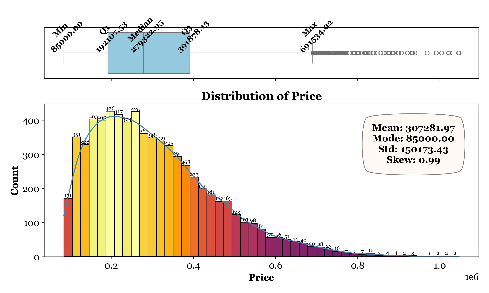
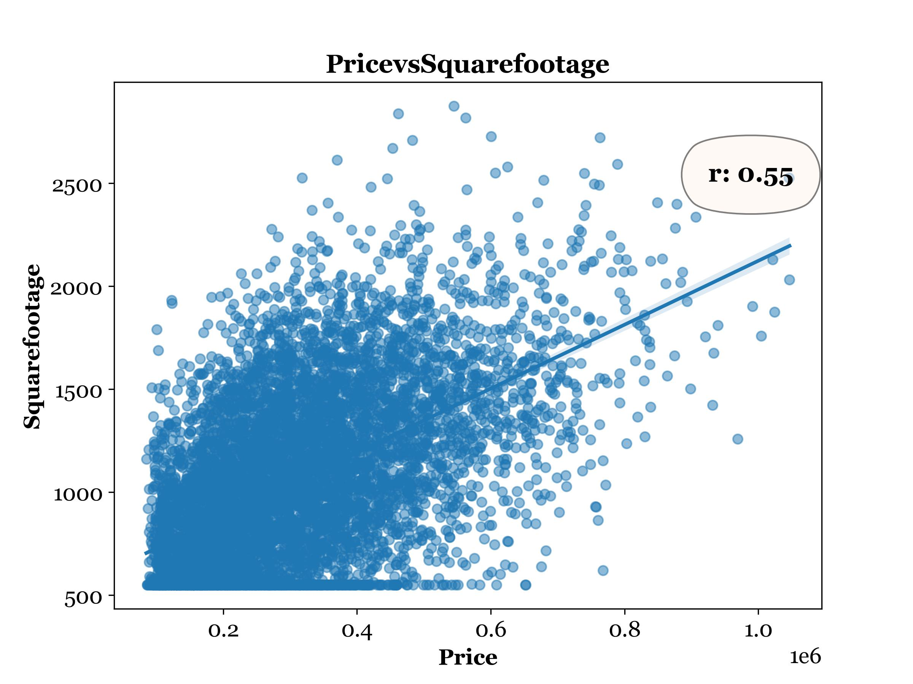
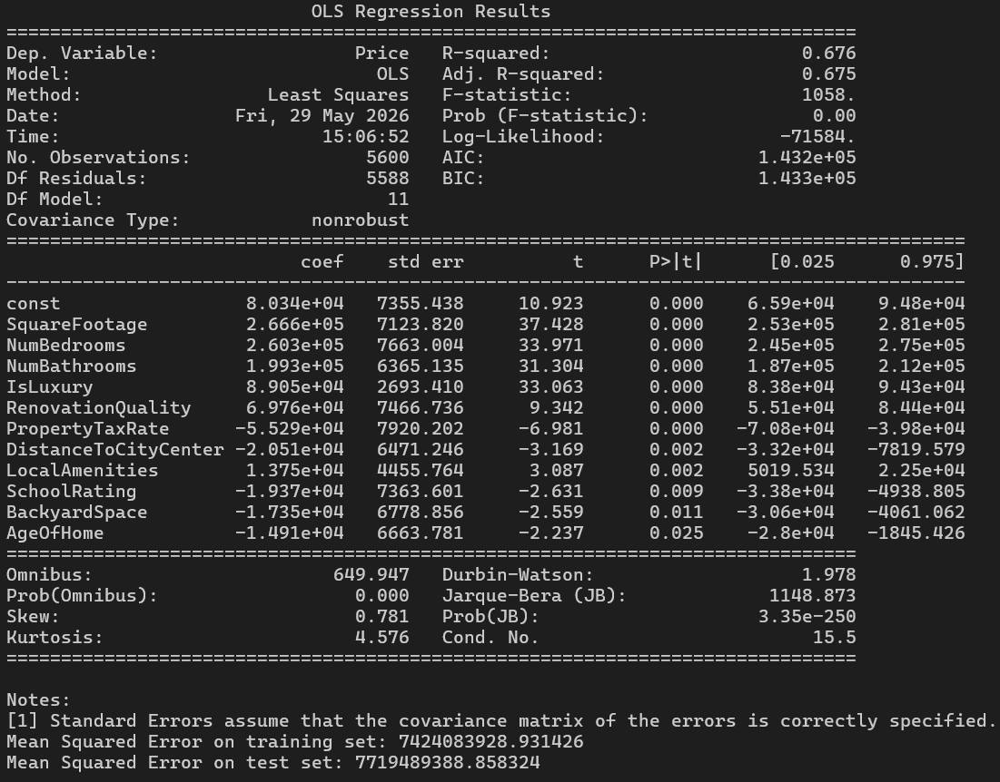
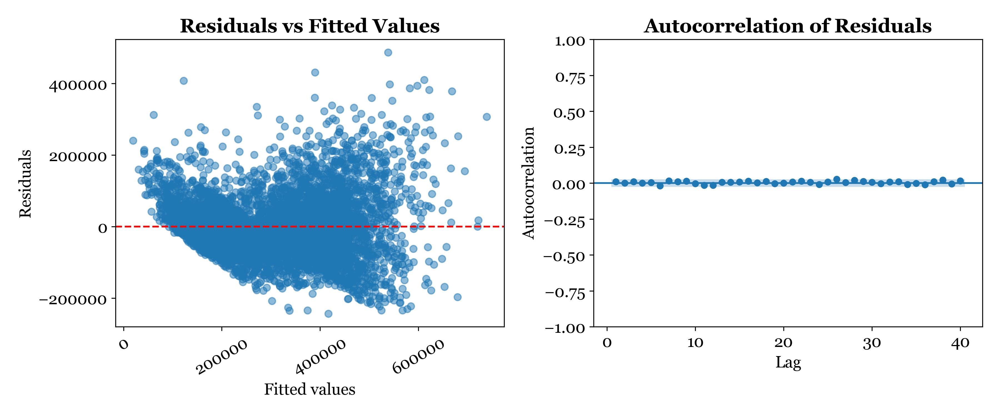

# Housing Price Prediction — Linear Regression Analysis

This project builds a **linear regression model** to predict housing prices based on property features. Using forward stepwise selection, the analysis identifies the most statistically significant predictors from 19 candidate variables — covering physical attributes, location factors, and amenities — and evaluates the model's performance on both training and test data.

The analysis covers:

- **Descriptive Statistics & Visualizations:** Univariate distributions and bivariate scatter plots for all candidate predictors against price, with Box-Cox transformation applied to skewed variables before correlation analysis.
- **Feature Selection:** Forward stepwise selection to identify the optimal subset of predictors, verified against backward elimination and recursive feature elimination — all methods converging on the same 11 variables.
- **Model Building & Evaluation:** Linear regression with standardized features, evaluated using R², adjusted R², F-statistic, and MSE on both training and test sets.
- **Assumption Verification:** Linearity, independence of errors, and homoscedasticity checks via residual and autocorrelation plots.

> **Note on Dataset Availability**
> The raw CSV file has been removed from this repository as the data is proprietary and cannot be shared publicly. All descriptive visualizations and model outputs generated during the analysis have been retained in the `Figures/` folder for reference and presentation purposes.

---

## Analysis Summary

### Dependent Variable

| Price Distribution |
|---|
|  |

### Independent Variables & Bivariate Analysis

For each predictor, a distribution plot and a scatter plot against `Price` are generated (with Box-Cox transformation applied where absolute skew > 1).

| Variable | Expected Effect on Price |
|---|---|
| `SquareFootage` | Positive |
| `NumBedrooms` | Positive |
| `NumBathrooms` | Positive |
| `BackyardSpace` | Positive |
| `CrimeRate` | Negative |
| `SchoolRating` | Positive |
| `AgeOfHome` | Negative |
| `DistanceToCityCenter` | Negative |
| `EmploymentRate` | Positive |
| `PropertyTaxRate` | Negative |
| `RenovationQuality` | Positive |
| `LocalAmenities` | Positive |
| `TransportAccess` | Positive |
| `Fireplace` | Positive |
| `HouseColor` | Variable |
| `Garage` | Positive |
| `Floors` | Positive |
| `Windows` | Positive |
| `IsLuxury` | Positive |

| Sample Scatter Plots (Predictors vs. Price) |
|---|
|  |

---

### Feature Selection — Forward Stepwise

The following 11 predictors were selected as the best model:

```
SquareFootage, NumBedrooms, NumBathrooms, IsLuxury, RenovationQuality,
PropertyTaxRate, DistanceToCityCenter, LocalAmenities, SchoolRating,
BackyardSpace, AgeOfHome
```

| Linear Regression Summary Output |
|---|
|  |

---

### Regression Equation

```
Price = 80,340
      + 266,600 × SquareFootage
      + 260,300 × NumBedrooms
      + 199,300 × NumBathrooms
      +  89,050 × IsLuxury
      +  69,760 × RenovationQuality
      -  55,290 × PropertyTaxRate
      -  20,510 × DistanceToCityCenter
      +  13,750 × LocalAmenities
      -  19,370 × SchoolRating
      -  17,350 × BackyardSpace
      -  14,910 × AgeOfHome
```

> Note: All predictors are standardized (MinMax scaled), so coefficients reflect relative impact in standard deviation units, not raw dollar amounts.

---

### Model Performance

| Metric | Training Set | Test Set |
|---|---|---|
| R² | 0.676 | — |
| Adjusted R² | 0.675 | — |
| F-statistic | 1,058 | — |
| MSE | ~7.4 billion | ~7.7 billion |
| RMSE | ~$86,163 | ~$87,900 |

The test MSE is only marginally higher than the training MSE, indicating the model generalizes well with minimal overfitting.

---

### Assumption Checks

| Residuals vs. Fitted Values & Autocorrelation of Residuals |
|---|
|  |

---

## How to Run

### Prerequisites

```bash
pip install -r requirements.txt
```

### Dataset Setup

Place the dataset CSV inside the `data/` folder:

```
project/
├── data/
│   └── your_dataset.csv        ← put it here
├── main.py
├── requirements.txt
└── README.md
```

### Run

```bash
python main.py
```

The script handles all descriptive analysis, feature selection, model training, assumption verification, and visualization steps automatically. All outputs and plots are saved to the `Figures/` folder.

---

## Project Structure

```
project/
├── data/                   # Raw input dataset (not included — see note above)
├── Figures/                 # Generated plots and model results
├── main.py                 # Entry point — run this
├── requirements.txt
└── README.md
```

## Key Libraries Used

| Library | Purpose |
|---|---|
| `pandas` | Data manipulation |
| `numpy` | Numerical operations |
| `matplotlib` / `seaborn` | Visualization |
| `scipy.stats` | Skewness, mode, Box-Cox transformation |
| `statsmodels` | Linear regression, model summary, MSE |
| `sklearn` | Train/test split, MinMax scaling |
