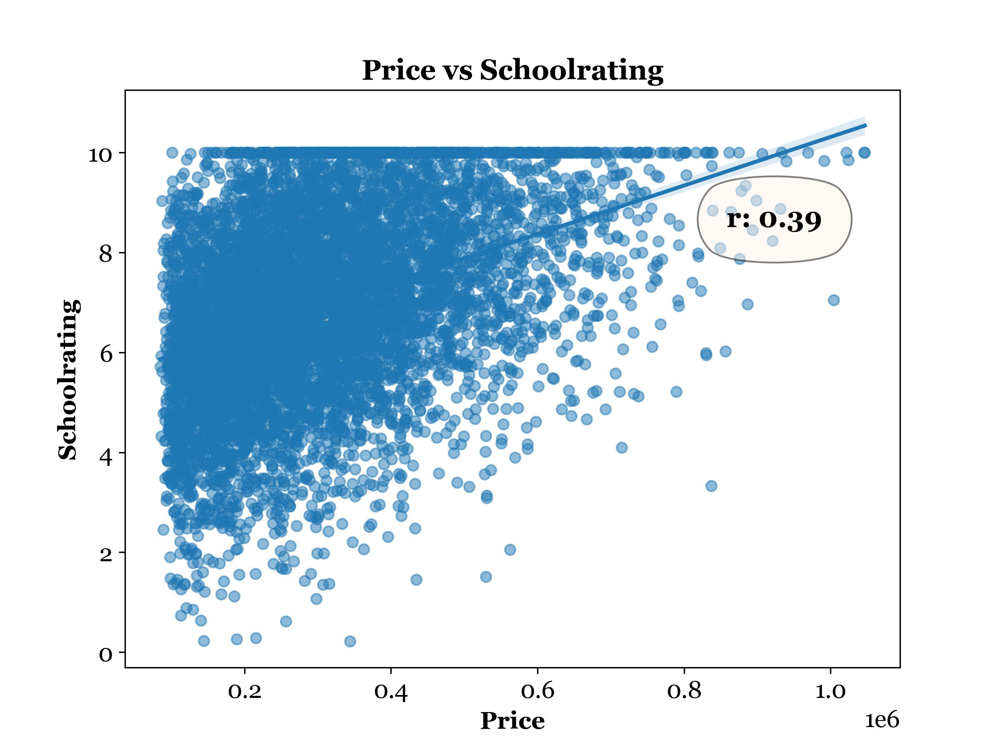
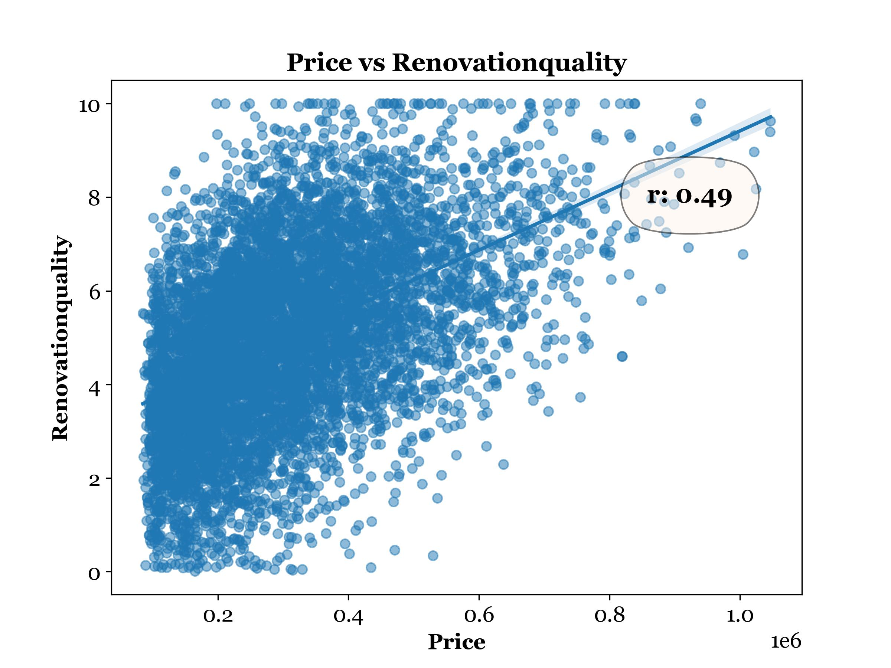
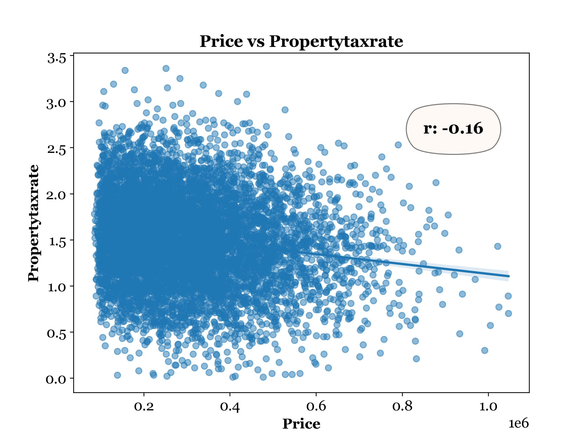

# Housing Price Prediction — Linear Regression Analysis

A linear regression model built to predict housing prices from 19 candidate property features. The emphasis is on rigorous feature selection, honest model evaluation, and catching the details that basic implementations tend to skip — scaled coefficient interpretation, residual anomalies, and the gap between R² and RMSE as performance narratives.

> **Note on Dataset Availability**
> The dataset has been removed from this repository for data ethics reasons. All generated visualizations, model summaries, and residual diagnostics are retained in the `Figures/` folder for reference and portfolio purposes.

---

## Research Question

**Can housing prices be predicted from physical, locational, and amenity-based property features — and which features carry the most weight?**

---

## Analysis Pipeline

1. Descriptive statistics and univariate distributions for all 19 candidate variables
2. Bivariate scatter plots with Box-Cox transformation applied before correlation where |skew| ≥ 1
3. Train / test split (80 / 20)
4. Forward stepwise feature selection, verified by backward elimination and recursive feature elimination
5. Linear regression on standardized (MinMax-scaled) predictors
6. Residual analysis: linearity, homoscedasticity, autocorrelation
7. Performance evaluation on training and test sets

---

## Feature Selection

Starting from 19 candidate predictors, **forward stepwise selection** was used to build the model incrementally — adding one variable at a time, keeping only those with a statistically significant contribution (p < 0.05).

**Why forward stepwise over including all variables:**
Including all 19 predictors risks overfitting and inflates the model with noise. Forward stepwise produces a parsimonious model where every included variable has earned its place statistically.

**Robustness check — three methods, one answer:**
Forward stepwise, backward elimination, and recursive feature elimination were all run independently. All three converged on the same 11 variables. When competing selection strategies agree, that is a meaningful signal: the chosen feature set is not an artifact of the method. It is genuinely the optimal subset.

**Selected predictors (11 of 19):**
`SquareFootage` · `NumBedrooms` · `NumBathrooms` · `IsLuxury` · `RenovationQuality` · `PropertyTaxRate` · `DistanceToCityCenter` · `LocalAmenities` · `SchoolRating` · `BackyardSpace` · `AgeOfHome`

**8 variables dropped:** `CrimeRate`, `EmploymentRate`, `TransportAccess`, `Fireplace`, `HouseColor`, `Garage`, `Floors`, `Windows` — none achieved statistical significance at the chosen threshold.

---

## Regression Equation

All predictors are MinMax-scaled before modeling. Coefficients therefore do not represent raw dollar amounts per unit — they represent the change in predicted price for a one-unit shift in the *scaled* (0–1) range of each variable. This enables direct comparison of relative influence across predictors.

```
Price = 80,340
      + 266,600 × SquareFootage
      + 260,300 × NumBedrooms
      + 199,300 × NumBathrooms
      +  89,050 × IsLuxury
      +  69,760 × RenovationQuality
      -  55,290 × PropertyTaxRate
      -  20,510 × DistanceToCityCenter
      +  13,750 × LocalAmenities
      -  19,370 × SchoolRating
      -  17,350 × BackyardSpace
      -  14,910 × AgeOfHome
```

| Linear Regression Model Summary |
|---|
|  |

**Counterintuitive findings worth noting:**

`SchoolRating` carries a **negative** coefficient (-19,370), as does `BackyardSpace` (-17,350). Both contradict intuition — better schools and more outdoor space are generally expected to increase property value. Several explanations are plausible: multicollinearity with other included predictors (e.g., school rating and distance to city center may be correlated), data encoding issues, or complex market dynamics where these variables behave differently at the lower and upper ends of the price distribution. These coefficients should not be treated as causal statements; they are correlational patterns within this dataset and model specification.

---

## Model Performance

| Metric | Training Set | Test Set |
|---|---|---|
| R² | 0.676 | — |
| Adjusted R² | 0.675 | — |
| F-statistic | 1,058 (p ≈ 0.00) | — |
| MSE | ~7.4 billion | ~7.7 billion |
| RMSE | ~$86,163 | ~$87,900 |

**R² vs. RMSE — two metrics, two narratives:**

R² of 0.676 says the model explains 67.6% of price variance, which reads as a reasonably strong fit for real estate data. RMSE of ~$86,000 says the typical prediction error is about $86,000 — which is 14.2% of the total price range ($85,000–$691,000). These are both accurate descriptions of the same model. R² is the optimistic framing; RMSE is the operational one. Neither is wrong, but reporting only one would be incomplete.

**Generalization:**
The test MSE (~7.7B) is only marginally higher than the training MSE (~7.4B), indicating the model generalizes well and is not overfitting. The selected feature set performs consistently on unseen data.

---

## Assumption Verification

| Residuals vs. Fitted Values & Autocorrelation |
|---|
|  |

**Linearity & independence:** Residual plots show no systematic curvature. Autocorrelation values are within confidence bounds — the independence assumption is satisfied.

**Heteroscedasticity (a real concern):** Residual spread increases with fitted price, indicating that prediction error grows for higher-priced homes. The model is less precise at the upper end of the price distribution.

**Floor effect — a subtle but meaningful anomaly:** For homes with low predicted prices (below ~$200,000), residuals show a sharp lower boundary — they rarely go negative. This means the model systematically *overestimates* the prices of lower-end homes. The likely cause is a price floor in the dataset ($85,000 minimum), which truncates the lower tail of the residual distribution. This is not a modeling error per se, but it signals that the model does not represent the lower price segment as well as the middle and upper ranges.

---

## Visualizations

**Price distribution:**
|  |

**Sample bivariate scatter plots (predictors vs. Price):**

| Square Footage vs. Price | School Rating vs. Price |
|---|---|
|  |  |

| Renovation Quality vs. Price | Property Tax Rate vs. Price |
|---|---|
|  |  |

---

## How to Run

```bash
pip install -r requirements.txt
```

Place the dataset CSV inside the `data/` folder, then:

```bash
python main.py
```

All analysis, model training, and figures are generated and saved to `Figures/` automatically.

---

## Project Structure

```
project/
├── data/                   # Dataset (not included — see note above)
├── Figures/                # All generated plots and model outputs
├── main.py                 # Entry point
├── requirements.txt
└── README.md
```

---

## Tech Stack

`Python` · `pandas` · `NumPy` · `Matplotlib` · `Seaborn` · `SciPy` · `statsmodels` · `scikit-learn`
